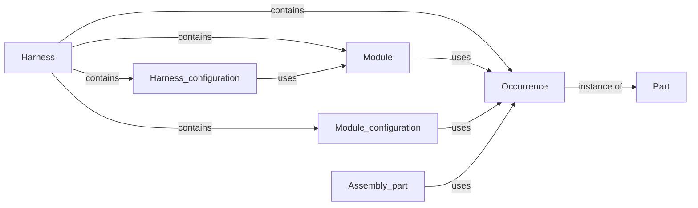
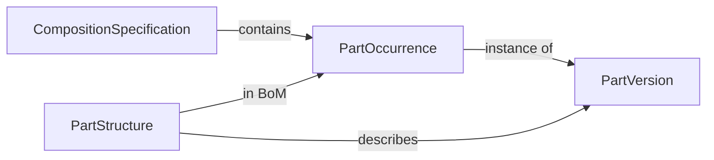
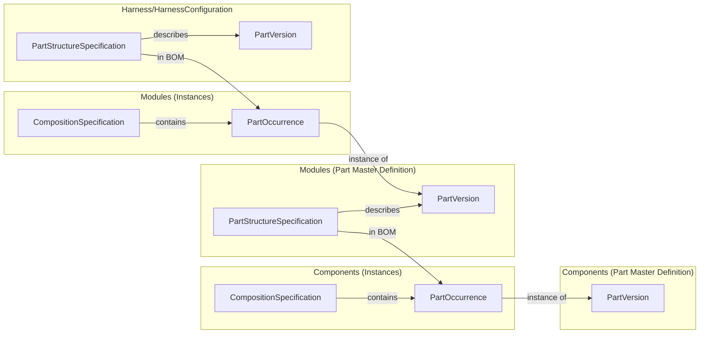



> **Editorial Note:** Since the creation of this implementation guideline will span an extended period, the current work-in-progress versions will be published continuously to allow the community to review and provide feedback.

This implementation guideline outlines the core concepts needed to create a dataset for a single wiring harness in the VEC, which is also the use case that lies in the center of the scope of the KBL.

To ease adoption for those already familiar with the KBL, this guideline is structured as a mapping from the KBL model to the VEC model. Additionally, a reference implementation of a KBL-to-VEC converter is available on [GitHub](https://github.com/4Soft-de/harness-model/tree/develop/kbl2vec/).

{} **Disclaimer:** This implementation guideline (along with the converter implementation) covers only the scope of the KBL. The VEC is a far more expressive model.

As a result, there are scenarios where the VEC could convey information with much clearer semantics. However, the necessary data for this level of precision is often not available in the KBL (e.g., detailed component data) or is embedded through custom properties and process/tool-specific dialects. "Healing" such data would require in-depth knowledge of the specific KBL dialect used and, in many cases, the integration of additional information sources (side-loading). This task lies outside the scope of this guideline. In situations where it is obvious that fixing of such deficiencies is advised, a **Data Quality** note is added.

The goal of this guideline is to demonstrate how standard KBL concepts map to VEC concepts—without improving the quality of the underlying information. While the VEC could indeed express many aspects more precisely, this guideline focuses on maintaining consistency with the original KBL data quality.{}

There are fundamentally two approaches to describing such a mapping. One can either start from the source model, explaining how its information is distributed into the target model, or take the opposite approach by defining which information is needed in the target model and where to find it in the source model. For this implementation guideline, the latter approach was chosen as the strategy.

On the one hand, the guideline's focus is on how to describe a harness in the VEC, which naturally suggests describing the mapping from this perspective. On the other hand, the VEC is the more precise model, meaning that many KBL concepts are distributed across different elements within the VEC. For example, a KBL  contains information relevant to the VEC concepts of a  ,  and . It is more logical to describe the mapping of topology and 2D/3D geometry as cohesive units rather than addressing all three concepts in a mixed manner starting from the KBL Node.

The implementation guideline focuses on the structural mapping and does not cover the mapping of individual attributes. If you are interested in those details, please refer to the reference implementation.

The guideline follows a logical order rather than an order dictated by model dependencies. Since the VEC is a graph—not a strict tree—it allows cross-references between branches. As a result, you may encounter cases where a model element references another model element whose mapping is described later in this guideline.

The reference implementation addresses this challenge by using a two-phase approach.
{}
VEC XML snippets in this guideline are taken from the KBL to VEC conversion output of the reference implementation. Input for that is the sample KBL file provided here: [Volkswagen - VOBES - Component Box]().
{}

## Starting Point

Everything starts with the model root element , see the figure below (all attributes omitted).



The following sub elements of the VEC are required for a harness description and are covered by some information in the KBL (the sections containing the detail information are linked):

- [PartVersions]()
- [DocumentVersions]()
- [Units]()

### PartVersions

The concept of parts is quite different in KBL and VEC. In the VEC a  is just a PDM-Header for the part. The various aspects of a part (e.g. is it a wire or connector) are handled by different types of s contained in the  describing the part. In the KBL, the different types of parts are expressed as subclasses of . The concept in the VEC that most closely reflects the approach of the KBL is the . 

{}
**Data Quality**: The mapping between KBL  subtypes and the  is merely a preliminary "best guess" approach. In many cases, the "standard" KBL provides only a very general classification, whereas the VEC allows for more specific distinctions. For example, the KBL only recognizes , while the VEC differentiates between , , and others.
{}

The following  could be used for KBL Parts:

| KBL Class   | VEC PrimaryPartType   |
|--------------|------------------------|
|  | `Other` |
|  | `Other` |
|  | `CavityPlug` |
|  | `CavitySeal` |
|  | `Wire` |
|  | `ConnectorHousing` |
|  | `Fixing` |
|  | `Terminal` |
|  | `WireProtection` |
|  | `PartStructure` |
|  | `PartStructure` |
|  | `PartStructure` |
|  | `PartStructure` |
|  | `Fuse` |
|  | `EEComponent` |
|  | `EEComponent` |

When mapping into the VEC, a  Object is required for each KBL . Those can be found under `/KBL_container/(Accessory|AssemblyPart|CavityPlug|...)`, `/KBL_container/Harness/Module` and `/KBL_container/Harness/Harness_configuration`.

{}
**Data Quality**: The KBL allows to have the same `Part_number` under different classifications. E.g. a tape can be used as  or as  to some other part (see  for more details). 

Due to other modeling approaches in the VEC, there is no longer any need for this. Multiple occurrences of the same part version in the VEC are considered a semantic error. Deduplication should be carried out in post-processing.
{}

### DocumentVersions

In the VEC, all payload data is contained within s. Typically, you would structure those according to the actual documents used in the process. Unfortunately, this concept in its detail form is not present in the KBL. Therefore, for the generic conversion described here, practical assumptions need to be made:

1. It is common practice to describe components in individual datasets/documents and publish them separately &rarr; one  for each harness component (e.g. connector, wire and terminal, see [Partitioning and Sizing]()), see section [Part Master Data]().
1. It is also common for a wiring harness to be fully described in a single 150% dataset, containing all information about the used component occurrences, variants, connectivity, dimensioning, and so on &rarr; one  for the harness itself, see section [Harness Description]().

This means that a s with `DocumentType=PartMaster` must be created for each component used in the wiring harness. These are all instances of  in the KBL except instances of .

For the  itself, a  with `DocumentType=HarnessDescription` is created. This document contains all relevant information about the harness as well as the s for the s and s.


## Part Master Data

For all components used in a wiring harness, a minimum set of part master data is required. 
A `PartMaster` document contains all s that are required to describe the component. For a general description of this concept see  the Guideline "[Component Description]()". The following specifications have to be created. The Mapping of those is described in the section [Specifications](): 

{}
**Data Quality**: Since the scope of the KBL is the product definition of a harness, the contained master data is limited to the bare minimum (e.g. cavities of a connector, cross section area and color of the wire). On the other hand, the VEC offers a wide range of options for a detailed component description. In a real scenario, it would therefore be more likely to enrich the data with information from a library during conversion than to transfer the master data from the KBL directly 1:1.
{}

The following table defines the  that are used to define each . Auxiliary specifications that might required by the  for a complete definition (e.g. ,  or ) are listed in the corresponding section.

| KBL Class   | VEC PartOrUsageRelatedSpecification   |
|--------------|------------------------|
|  | , TBD |
|  | , TBD |
|  | , TBD |
|  | , TBD |
|  | ,  TBD |
|  | , , TBD |
|  | , TBD |
|  | , TBD |
|  | , TBD |
|  | , TBD |
|  | , TBD |
|  | , TBD |
|  | , TBD |
|  | , TBD |
|  | , TBD |
|  | , TBD |


{}
Work in Progress
{}


## Harness Description

{}
Work in Progress
{}

A `HarnessDescription` document contains all s that are required to describe a Harness. The specifications in the VEC provide a more "view oriented" modelling approach than the KBL. Each specification representing a specific view on the product model, with the possibility to have links between the views. The following sections will describe the mapping topic by topic (or, in other words view by view).

A VEC derived from a single KBL contains one `HarnessDescription` document for the  defined in the KBL.

### Bill of Material / Part Structure

One central view on the product is the bill of material (BoM) or part structure. The information which parts (components) are used for the harness, its variants and modules.

The KBL has a very explicit definition of the part structure with predefined levels and semantics, compare the diagram below (_Note: The diagram is, for the sake of simplicity, conceptually and not precisely KBL syntax_):

- : The container for all variants and part occurrences that compose a harness description (150% definition).
- : A subset of part occurrences the is used for variant management within the harness (< 100%).
- : A set of s used define specific variants of a harness (= 100%)
- : A subset of part occurrences without part number (< 100%).
- : A predefined part consisting of multiple parts, that is used within a harness (e.g. a USB-Cable).
- : A occurrence (usage) of a part/component within the harness with capability to define usage specific information (e.g. wire length).



In contrast, the VEC provides a highly generic and flexible concept for representing Bills of Material (BoMs). While a strictly defined and semantically precise model, like the one in KBL, has clear advantages — such as unambiguous interpretation and validation — it must also be capable of reflecting real-world complexity. The rigid semantics of the KBL work well within its original scope, but become increasingly insufficient when moving beyond it.

In broader application scenarios, additional concepts are often required, such as production modules, lead sets, or vehicle configurations e.g. for cost and variant calculations. Furthermore, the interpretation of certain concepts may vary depending on the stakeholder’s perspective. For example, an OEM might define a structure as an assembly, whereas a Tier1-supplier may regard the same structure as a module. This highlights the need for more adaptable and context-aware modeling approaches, as supported by the VEC. The basic concepts are illustrated in the following diagram:


The  serves as a container for defining s. At this stage, it is not yet associated with any specific part and does not represent a configuration of parts. Such an independent container is necessary, particularly when describing variant-rich (150%) products, where individual occurrences of parts cannot always be uniquely assigned to a single configuration unit and may be reused in multiple contexts (150% definition).

Using the , subsets of the previously defined s can now be selected and defined as the Bill of Material (BoM) for a specific . These s can, in turn, be instantiated as s to define another level of the BoM.

This recursive structure allows for the representation of hierarchical BoMs of arbitrary depth, as well as parallel BoM structures—for example, engineering BoM (EBOM) and manufacturing BoM (MBOM).

The assignment to semantics commonly used in harness development (such as harness, module, etc.) is done via the `content` attribute of the  with literals defined in . This classification then implies semantic constraints — for example, with respect to completeness (e.g. 100%, 150%) and the types of elements that are allowed.

A typical example: a variant usually consists of modules, which means that only s representing modules may be referenced in a variant’s BoM.
 
As shown in the diagram above, the Bill of Materials (BoM) structure in KBL essentially consists of three levels:

1. ** / **: This represents the top level of the hierarchical BoM. The interpretation of the  element varies depending on whether the context is a staged wiring harness (Stufenleitungssatz) or a customer-specific harness (KSK):

    * In the case of a KSK, the  represents a 150% BoM of all orderable modules. Existing  elements are orthogonal to this and typically represent predefined variants, e.g., for calculation purposes.
    * For staged harnesses, the  element merely serves as a container for defining the various variants, which are modeled as  elements.
2. **s**: Break down the complete set of all occurrences (150%) into smaller subset suitable for variant management.
3. ****: All instances of the harness components (e.g. connectors, wires)

The basic mapping of those concepts into the generic approach of the VEC is illustrated in the diagram below.


Each layer consists of a part master definition (), that is used to create instances () within a container for the layer (). For the sake of a modular data structure, each layer defines its own . The  of one layer are then used to define the part master defintion of the next layer ( and ).

{}
A detail not shown in the diagram above is that an instance of a BoM part must include references to its subcomponents. In the case of library parts (i.e.,  in KBL), the subcomponents are represented by distinct  instances, separate from those used to define the part’s structure.

In contrast, for modules within a wiring harness, the same  instances are reused, both to define the structure and for instantiation. This distinction reflects different instantiation approaches and has important implications for reuse and traceability. A detailed explanation of these modeling approaches can be found in the VEC specification under: 

{}

#### Mapping KBL Classification to `PartStructureContentType`

The following table defines the Mapping between KBL classifications and s.

| KBL Classification | `PartStructureContentType` |
| -------- | ------- |
|   | `Harness`    |
|  | `Variant`    |
|     | `Module`    |
|     | `Assembly`    |

#### XML Representation
The following XML listings explain the BoM mapping in detail. They start from the lowest level (the components) and the end at the top (the harness).

The first step is to create the basic occurrences for the harness. For every  in the KBL  a  is created. An exception is the KBL , which is not representing an occurrence of a component, and therefore no  is created in the VEC. The s are omitted in the snippet below, as this a seperate topic, handled in [Instantiation of Components](). The `Identification` used for the  is `COMPONENTS`.

```xml
    <Specification xsi:type="vec:CompositionSpecification" id="CompositionSpecification_00289">
      <Identification>COMPONENTS</Identification>
      <Component id="PartOccurrence_00290">
        <Identification>GenericIdentifier-0</Identification>
        <Part>PartVersion_00375</Part>
        ...
      </Component>
      <Component id="PartOccurrence_00291">
        <Identification>GenericIdentifier-1</Identification>
        <Part>PartVersion_00375</Part>
        ...
      </Component>
      ...
    </Specification>
```

For each module, a  is created, referencing the occurrences that belong to the module, defined above.

```xml
    <Specification xsi:type="vec:PartStructureSpecification" id="PartStructureSpecification_00368">
      <Identification>PSS-MDL123456</Identification>
      <DescribedPart>PartVersion_00504</DescribedPart>
      <Content>Module</Content>
      <InBillOfMaterial>PartOccurrence_00291 PartOccurrence_00290 ...</InBillOfMaterial>
    </Specification>
```
To define the next layer, instance of the modules are required. Those are created within a separate   with the `Identification = 'MODULES'`. As it can be seen, the module  references the same component  as the . This is, because modules are normally defined in-place (see ). However, to provide a consistent appearance in the model for all parts with a BoM, both concepts shall be used.

```xml
    <Specification xsi:type="vec:CompositionSpecification" id="CompositionSpecification_00286">
      <Identification>MODULES</Identification>
      <Component id="PartOccurrence_00287">
        <Identification>MDL123456</Identification>
        <Role xsi:type="vec:PartWithSubComponentsRole" id="PartWithSubComponentsRole_00288">
          <Identification>MDL123456</Identification>
          <PartStructureSpecification>PartStructureSpecification_00368</PartStructureSpecification>
          <SubComponent>PartOccurrence_00291 PartOccurrence_00290 ...</SubComponent>
        </Role>
        <Part>PartVersion_00504</Part>
      </Component>
    </Specification>
```
As a Module is now a regular  the generic concepts in the VEC for s can now be applied (e.g. Variant Management, see below) and no module specific modelling concepts, like the KBL `Logistic_control_information` are required.

Based on the module s, now a  for the harness can be defined.

```xml
    <Specification xsi:type="vec:PartStructureSpecification" id="PartStructureSpecification_00367">
      <Identification>PSS-LTG0011200</Identification>
      <DescribedPart>PartVersion_00500</DescribedPart>
      <InBillOfMaterial>PartOccurrence_00287 ...</InBillOfMaterial>
    </Specification>
```

### Instantiation of Components
{}
Work in Progress
{}

### Variance Information for Modules
{}
Work in Progress
{}

### Topology

{}
Work in Progress
{}


{}
Explain the speciality of two composition specifications
{}

{}
TODO: Define Mapping of Module Configuration
{}

## Specifications

### GeneralTechnicalPartSpecification

### ConnectorHousingSpecification

### TopologySpecification

### CompositionSpecification

Modules describe dual character of modules (occurrence & part). 

#### PartOccurrences
Identification is mandatory... not all KBL Occurrences have mandatory identification.


## Core Elements

### Custom Properties / Installation Information

KBL Installation Information not always used as custom property.

### String / LocalizedStrings

{}
TODO: Locale must be guessed.
{}

### NumericalValue

### Units

To define numerical values, both the VEC and the KBL require units. If the attributes `Si_unit_name`, `Si_prefix`, and `Si_dimension` have been used to define a KBL , it can be mapped straight forward to a  in the VEC.

{}
**Data Quality**: The KBL supports only a very limited set of SI units (see ) and, in particular, does not support composite units (e.g., g/m). Such units are typically defined using the freely selectable `Unit_name`. When translating this into the VEC, those units can only be mapped to a VEC .
{}